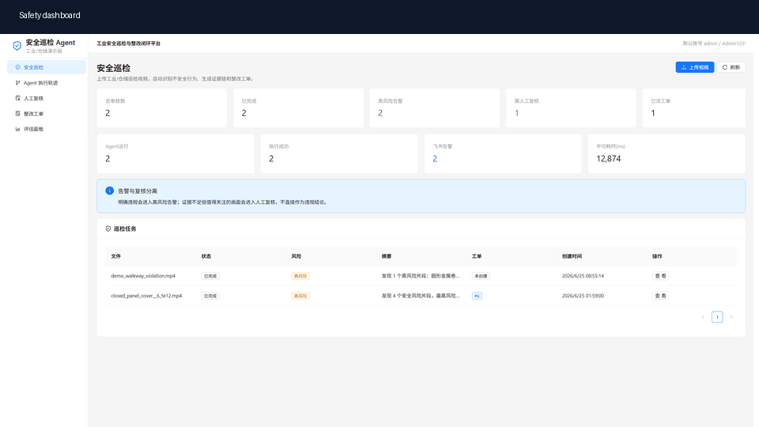
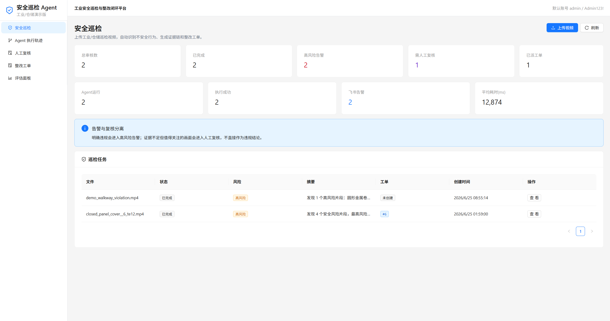
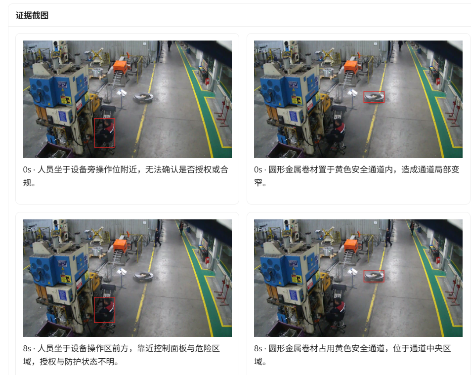
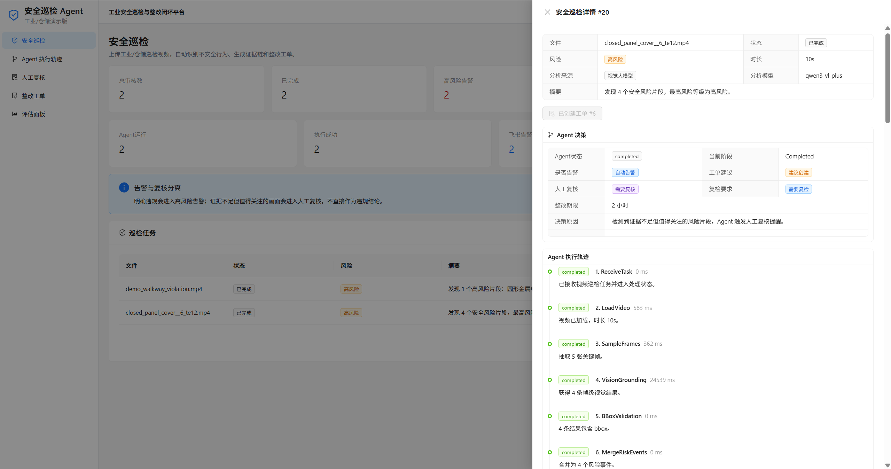
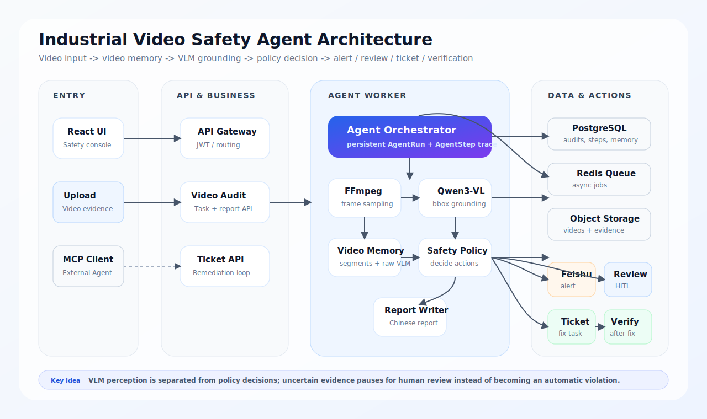
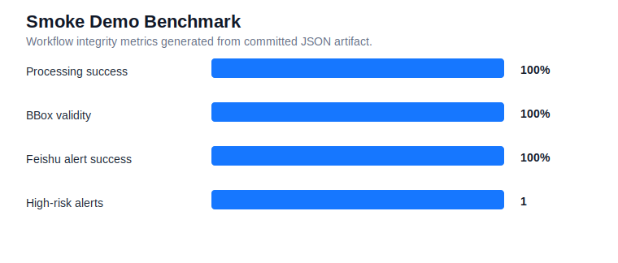

# Industrial Video Safety Agent

[English](README.md) | [简体中文](README.zh-CN.md)

> Multimodal Agent platform for industrial and warehouse safety inspection.
> Upload an inspection video, let a vision-language model ground risks with bounding boxes, trigger alerts, route human review, create remediation tickets, and verify the fix.

[](https://www.python.org/)
[](https://fastapi.tiangolo.com/)
[](https://react.dev/)
[](https://docs.docker.com/compose/)
[](https://github.com/hengshanmoshibo-alt/industrial-video-safety-agent/actions/workflows/ci.yml)
[](services/safety-mcp-server)
[](LICENSE)

中文定位：**工业安全巡检多模态 Agent 平台**。  
Chinese positioning: **industrial safety inspection multimodal Agent platform**.
It is not a generic chatbot demo. It is a vertical Agent application that turns video evidence into an operational safety workflow.

## What Makes It Different

- **Agent-first workflow**: every inspection creates persisted `AgentRun` and `AgentStep` records, not just a final prediction.
- **Video memory**: key frames become searchable `VideoMemorySegment` records with objects, bbox, evidence text, and raw VLM output.
- **Grounded evidence**: risk findings include time range, Chinese explanation, remediation advice, confidence, and bbox overlays.
- **Prompt contract**: the shared VLM prompt and JSON schema are public in [prompts](prompts), and validated by `python scripts/dev.py prompt-check`.
- **Policy-driven actions**: VLM perception is separated from alert/review/ticket decisions through `SafetyPolicy`.
- **Human-in-the-loop**: uncertain results pause for supervisor review instead of becoming automatic violation conclusions.
- **Operational loop**: Feishu alert, remediation ticket, post-remediation evidence, and Agent verification are part of the flow.
- **Tool ecosystem**: selected capabilities are exposed as MCP tools for external Agent integration.

## Why This Project

Most safety video demos stop at classification. This project focuses on the full loop:

```text
Video upload
  -> AgentRun starts
  -> frame sampling
  -> video memory
  -> VLM risk grounding
  -> bbox evidence
  -> safety policy decision
  -> Feishu alert
  -> human review
  -> remediation ticket
  -> post-remediation evidence
  -> Agent verification
  -> archive
```

The design is inspired by strong open-source Agent patterns:

- [Qwen-Agent](https://github.com/QwenLM/Qwen-Agent): tool use, planning, memory, MCP/RAG direction.
- [LangGraph](https://github.com/langchain-ai/langgraph): durable execution and human-in-the-loop state.
- [VisionAgent](https://github.com/landing-ai/vision-agent): vision task tooling and grounding-first workflows.
- [VideoAgent](https://github.com/YueFan1014/VideoAgent): build video memory first, then reason over memory.
- [OpenAI Agents SDK](https://github.com/openai/openai-agents-python): tracing, guardrails, handoffs, and tool orchestration patterns.

## Core Capabilities

- **Multimodal video inspection**: samples key frames from industrial/warehouse videos and analyzes them with an OpenAI-compatible vision model such as `qwen3-vl-plus`.
- **Risk grounding**: outputs risk label, time range, confidence, Chinese explanation, remediation advice, and bbox coordinates.
- **Agent observability**: stores `AgentRun`, `AgentStep`, tool latency, intermediate outputs, artifacts, and failure state.
- **Video memory**: stores structured key-frame memory and risk evidence segments for traceable review.
- **Safety policy engine**: separates “what the VLM sees” from “what the business should do”.
- **Human-in-the-loop**: uncertain findings pause the Agent at `waiting_review`; supervisor review resumes the workflow.
- **Alerting**: high-risk and review-worthy events can trigger signed Feishu bot alerts.
- **Remediation loop**: creates remediation tickets, accepts post-remediation evidence, and verifies the fix.
- **Evaluation panel**: tracks processing success, bbox validity, alert success, review confirmation, false positives, and latency.
- **MCP tools**: exposes `inspect_safety_frame`, `query_video_memory`, and `send_feishu_alert` for external Agent integration.

## Product Screens

The safety-only frontend contains:

- Safety Inspection
- Agent Trace
- Human Review
- Remediation Tickets
- Evaluation Panel

Legacy customer-service modules remain in the codebase, but `docker-compose.safety.yml` starts only the safety inspection platform.

## Demo Flow



## Screenshots

Safety dashboard with Agent metrics, high-risk alerts, human review count, and remediation status:



Risk grounding evidence with bbox overlays and Chinese evidence captions:



Agent execution trace showing tool calls, latency, decisions, and intermediate reasoning:



## Architecture



## Agent Workflow

Each inspection creates one Agent run and a tool-level execution trace:

The machine-readable workflow contract lives in
[config/safety_agent_workflow.json](config/safety_agent_workflow.json), with a
rendered explanation in [docs/agent-state-graph.md](docs/agent-state-graph.md).

| Tool | Purpose |
| --- | --- |
| `receive_task` | Create an auditable AgentRun for the uploaded video. |
| `load_video` | Load original video and metadata. |
| `sample_video_frames` | Extract key frames and persist frame artifacts. |
| `inspect_safety_frame` | Call the VLM for risk labels and bbox grounding. |
| `validate_bbox` | Downgrade unreliable localization to human review. |
| `merge_risk_events` | Merge adjacent frame-level findings into risk events. |
| `build_video_memory` | Store frame memory and evidence segments. |
| `decide_safety_action` | Apply policy: alert, review, ticket, verification. |
| `write_audit_report` | Generate a concise Chinese inspection report. |
| `send_feishu_alert` | Send high-risk alert or review reminder. |
| `recommend_remediation_ticket` | Prepare ticket recommendation for supervisor confirmation. |
| `verify_remediation` | Evaluate post-remediation evidence. |

## Quick Start

Prerequisites:

- Docker Desktop
- Git
- A vision model API key if you want real VLM recognition

Check your local environment:

```bash
python scripts/dev.py doctor
python scripts/dev.py init-env
```

For Alibaba DashScope / Qwen VL, configure an OpenAI-compatible endpoint in `.env`:

```env
VISION_ENABLED=true
VISION_BASE_URL=https://dashscope.aliyuncs.com/compatible-mode/v1
VISION_API_KEY=your_key_here
VISION_MODEL=qwen3-vl-plus
```

Optional Feishu alert:

```env
FEISHU_ALERT_ENABLED=true
FEISHU_WEBHOOK_URL=your_feishu_webhook
FEISHU_WEBHOOK_SECRET=your_signing_secret
```

Start the safety platform:

```bash
python scripts/dev.py up
```

Open:

```text
http://localhost:5173
admin / Admin123!
```

### Seed A Deterministic Demo

To see the full product without a VLM key, seed one complete inspection:

```bash
python scripts/dev.py seed
```

This creates one high-risk walkway-obstruction audit with bbox evidence, video memory, Agent steps, a seeded Feishu alert event, a Chinese report, and a ticket recommendation. The remediation ticket is intentionally not created by default so you can demonstrate the click-to-create workflow.

See [docs/demo.md](docs/demo.md) for the live-demo checklist.
See [docs/developer-commands.md](docs/developer-commands.md) for all local command shortcuts.
See [docs/demo-script.md](docs/demo-script.md) for a five-minute presentation script.

### API Client Example

After seeding the demo, run:

```bash
python scripts/dev.py api-demo
```

It logs in, prints evaluation metrics, fetches the latest audit explanation, and queries video memory segments with bbox evidence.

### MCP Client Example

Configure an MCP client with [examples/mcp_client_config.json](examples/mcp_client_config.json), or run the stdio protocol demo:

```bash
python scripts/dev.py mcp-tools
```

See [docs/mcp-client-demo.md](docs/mcp-client-demo.md) for the full flow.
The shared VLM prompt contract is documented in [prompts](prompts).

## Evaluation

Run tests and build:

```bash
python scripts/dev.py verify
```

Run API-level evaluation with public samples:

```bash
python scripts/download_safety_dataset.py
python scripts/evaluate_safety_agent.py --mode api --max-samples 24
```

See [docs/benchmark.md](docs/benchmark.md) for smoke benchmark and public dataset evaluation guidance.

A deterministic smoke benchmark artifact is included at [docs/assets/benchmarks/smoke-demo-metrics.json](docs/assets/benchmarks/smoke-demo-metrics.json).
The generated smoke report and chart are available at
[docs/assets/benchmarks/smoke-demo-report.md](docs/assets/benchmarks/smoke-demo-report.md).



The frontend Evaluation Panel shows:

- video processing success rate
- bbox validity rate
- high-risk alert count
- Feishu alert success rate
- human-review confirmation rate
- false-positive rate
- average processing latency

## Public Dataset

The project is designed for open safety video samples:

- Hugging Face: [Voxel51/Safe_and_Unsafe_Behaviours](https://huggingface.co/datasets/Voxel51/Safe_and_Unsafe_Behaviours)
- Mendeley: [Safe and Unsafe Behaviours Dataset](https://data.mendeley.com/datasets/xjmtb22pff/1)

The dataset contains industrial safe/unsafe behavior videos and is suitable for demo, regression evaluation, and optional local classifier training.

## MCP Tools

The lightweight MCP server lives in [services/safety-mcp-server](services/safety-mcp-server).

```bash
pip install -r services/safety-mcp-server/requirements.txt
python services/safety-mcp-server/server.py
```

Tools:

- `inspect_safety_frame`
- `query_video_memory`
- `send_feishu_alert`

For a lightweight API integration example, see [examples](examples).

## API Highlights

| Endpoint | Description |
| --- | --- |
| `POST /api/video-audits` | Upload inspection video. |
| `GET /api/video-audits/{id}` | Detail with findings, evidence, memory, Agent run, reviews, alerts. |
| `GET /api/video-audits/{id}/memory` | Query video memory segments. |
| `GET /api/video-audits/{id}/agent-explanation` | Explain what the Agent saw and why it acted. |
| `POST /api/video-audits/{id}/review` | Submit human-review decision. |
| `POST /api/video-audits/{id}/resume` | Resume Agent after review. |
| `POST /api/video-audits/{id}/tickets` | Create remediation ticket after confirmation. |
| `POST /api/tickets/{id}/verification` | Upload post-remediation evidence. |
| `GET /api/video-audits/metrics/evaluation` | Evaluation and observability metrics. |
| `GET /api/safety-tools` | List internal Agent tools. |

## Roadmap

See [ROADMAP.md](ROADMAP.md).

Near-term high-impact items:

- LangGraph-style explicit state graph
- semantic retrieval over video memory
- bbox IoU evaluation on labeled samples
- public release package with benchmark attachments

## Safety Notice

This project is an inspection assistant. It is not a certified safety system. High-risk, critical, and uncertain results must be reviewed by a qualified safety supervisor using original video and site context.

## Contributing

Contributions are welcome. Start with [CONTRIBUTING.md](CONTRIBUTING.md).

For design rationale, see the [documentation index](docs/README.md) and ADRs in [docs/adr](docs/adr).

Good first areas:

- new safety policies
- better VLM prompts
- evaluation scripts
- evidence visualization
- MCP clients
- frontend polish

## License

MIT License. See [LICENSE](LICENSE).
