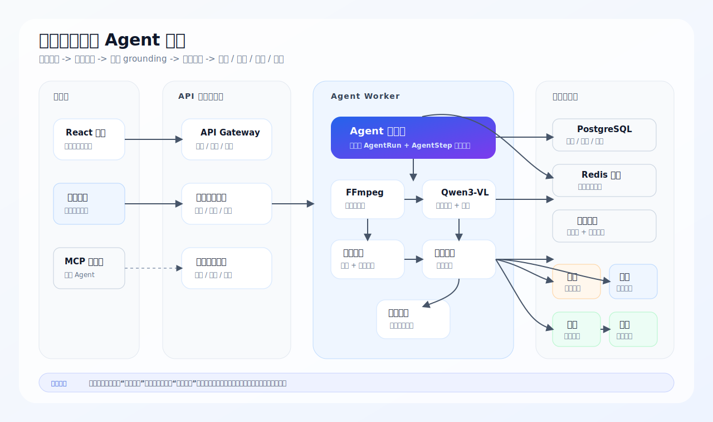

# 工业安全巡检 Agent

[English](README.md) | 简体中文

> 面向工业/仓储场景的多模态视频安全巡检 Agent 平台。  
> 上传巡检视频后，系统自动抽帧、调用视觉大模型识别风险和 bbox、生成视频记忆、触发飞书告警、进入人工复核、创建整改工单，并支持整改后证据复检。

[](https://www.python.org/)
[](https://fastapi.tiangolo.com/)
[](https://react.dev/)
[](https://docs.docker.com/compose/)
[](https://github.com/hengshanmoshibo-alt/industrial-video-safety-agent/actions/workflows/ci.yml)
[](services/safety-mcp-server)
[](LICENSE)

这个项目不是普通的视频分类 Demo，也不是套壳聊天机器人。它把“视频证据”变成可以审计、复核、告警、派单和复检的企业安全闭环。

## 项目亮点

- **Agent 工作流可观测**：每次巡检都会生成 `AgentRun` 和 `AgentStep`，记录工具调用、耗时、输入输出摘要和失败状态。
- **视频记忆**：关键帧被结构化保存为 `VideoMemorySegment`，包含可见对象、风险主体、bbox、证据描述和 VLM 原始结论。
- **视觉 grounding**：风险结果包含时间段、中文解释、整改建议、置信度和红框证据图。
- **提示词契约公开**：共享 VLM prompt 与 JSON schema 位于 [prompts](prompts)，并通过 `python scripts/dev.py prompt-check` 校验。
- **策略决策中心**：视觉大模型负责“看到了什么”，`SafetyPolicy` 负责“是否告警、是否复核、是否建议派单、是否需要复检”。
- **人工复核闭环**：不确定结果会暂停到人工复核，不会直接变成正式违规结论。
- **整改闭环**：支持飞书告警、整改工单、整改后证据上传和 Agent 复检。
- **MCP 扩展**：暴露 `inspect_safety_frame`、`query_video_memory`、`send_feishu_alert` 等工具，方便外部 Agent 集成。

## 为什么做这个项目

很多安全视频项目只做到分类或检测。本项目关注完整业务链路：

```text
视频上传
  -> AgentRun 启动
  -> 抽取关键帧
  -> 构建视频记忆
  -> 视觉大模型识别风险并框选主体
  -> bbox 证据生成
  -> 安全策略决策
  -> 飞书告警
  -> 人工复核
  -> 创建整改工单
  -> 上传整改后证据
  -> Agent 复检
  -> 闭环归档
```

设计参考了这些优秀开源 Agent 项目的思路：

- [Qwen-Agent](https://github.com/QwenLM/Qwen-Agent)：工具调用、规划、记忆、MCP/RAG 方向。
- [LangGraph](https://github.com/langchain-ai/langgraph)：持久化执行与 human-in-the-loop 状态。
- [VisionAgent](https://github.com/landing-ai/vision-agent)：视觉任务工具化与 grounding-first 工作流。
- [VideoAgent](https://github.com/YueFan1014/VideoAgent)：先构建视频记忆，再基于记忆推理。
- [OpenAI Agents SDK](https://github.com/openai/openai-agents-python)：Tracing、Guardrails、Handoff、工具编排模式。

## 核心功能

- **多模态视频巡检**：从工业/仓储视频中抽取关键帧，调用 OpenAI-compatible 视觉模型，例如 `qwen3-vl-plus`。
- **风险定位**：输出风险标签、时间范围、置信度、中文证据说明、整改建议和 bbox 坐标。
- **Agent 执行轨迹**：保存工具调用过程、耗时、阶段、错误和中间产物。
- **视频记忆**：保存关键帧结构化记忆，用于追溯和复核。
- **策略决策**：将 VLM 感知结果和业务动作解耦。
- **飞书告警**：高风险或需要复核的事件可以自动发送签名飞书机器人告警。
- **人工复核**：支持 `confirmed_violation`、`false_positive`、`needs_more_evidence`。
- **整改工单**：主管确认后创建整改工单，记录风险证据和整改要求。
- **整改复检**：上传整改后图片或视频，Agent 判断 `passed`、`failed` 或 `needs_review`。
- **评估面板**：展示处理成功率、bbox 有效率、飞书告警成功率、人工复核确认率、误报率和平均耗时。

## 产品页面

安全演示版前端只保留工业安全相关模块：

- 安全巡检
- Agent 执行轨迹
- 人工复核
- 整改工单
- 评估面板

旧客服模块代码仍保留在仓库中，但 `docker-compose.safety.yml` 默认只启动安全巡检平台。

## 演示与截图


安全巡检首页：展示高风险告警、人工复核数量、飞书告警和平均处理耗时。


风险证据截图：展示 bbox 红框和中文证据描述。


Agent 执行轨迹：展示工具调用、耗时、决策和中间步骤。


## 架构



## Agent 工作流

每个巡检任务都会创建一次 Agent run，并记录工具级执行轨迹。机器可读的工作流契约位于 [config/safety_agent_workflow.json](config/safety_agent_workflow.json)，解释文档见 [docs/agent-state-graph.md](docs/agent-state-graph.md)。

| 工具 | 作用 |
| --- | --- |
| `receive_task` | 为上传视频创建可审计的 AgentRun。 |
| `load_video` | 加载原始视频和元数据。 |
| `sample_video_frames` | 抽取关键帧并保存帧产物。 |
| `inspect_safety_frame` | 调用视觉大模型识别风险和 bbox。 |
| `validate_bbox` | 校验定位质量，必要时降级到人工复核。 |
| `merge_risk_events` | 将帧级风险合并为事件。 |
| `build_video_memory` | 保存视频记忆和证据片段。 |
| `decide_safety_action` | 根据策略决定告警、复核、工单和复检。 |
| `write_audit_report` | 生成中文安全巡检报告。 |
| `send_feishu_alert` | 发送高风险告警或复核提醒。 |
| `recommend_remediation_ticket` | 生成整改工单建议，等待主管确认。 |
| `verify_remediation` | 识别整改后证据并输出复检结论。 |

## 快速开始

前置依赖：

- Docker Desktop
- Git
- 如需真实视觉识别，需要配置视觉大模型 API Key

检查本地环境：

```bash
python scripts/dev.py doctor
python scripts/dev.py init-env
```

如使用阿里 DashScope / Qwen VL，在 `.env` 中配置 OpenAI-compatible endpoint：

```env
VISION_ENABLED=true
VISION_BASE_URL=https://dashscope.aliyuncs.com/compatible-mode/v1
VISION_API_KEY=your_key_here
VISION_MODEL=qwen3-vl-plus
```

可选飞书告警：

```env
FEISHU_ALERT_ENABLED=true
FEISHU_WEBHOOK_URL=your_feishu_webhook
FEISHU_WEBHOOK_SECRET=your_signing_secret
```

启动安全巡检平台：

```bash
python scripts/dev.py up
```

访问：

```text
http://localhost:5173
admin / Admin123!
```

## 初始化演示数据

如果没有视觉模型 Key，也可以种子化一个完整演示任务：

```bash
python scripts/dev.py seed
```

它会创建一条高风险通道占用巡检任务，包含 bbox 证据、视频记忆、Agent steps、飞书告警记录、中文报告和工单建议。默认不会直接创建整改工单，方便现场演示“点击创建工单”的闭环能力。

更多演示步骤见 [docs/demo.md](docs/demo.md)，命令说明见 [docs/developer-commands.md](docs/developer-commands.md)，五分钟讲解稿见 [docs/demo-script.md](docs/demo-script.md)。

## API 与 MCP 示例

种子数据生成后，可以运行 API 示例：

```bash
python scripts/dev.py api-demo
```

也可以运行 MCP stdio 协议演示：

```bash
python scripts/dev.py mcp-tools
```

MCP 客户端配置见 [examples/mcp_client_config.json](examples/mcp_client_config.json)，完整说明见 [docs/mcp-client-demo.md](docs/mcp-client-demo.md)。共享 VLM 提示词契约见 [prompts](prompts)。

## 测试与评估

运行后端测试、前端构建和配置检查：

```bash
python scripts/dev.py verify
```

使用公开样例做 API 级评估：

```bash
python scripts/download_safety_dataset.py
python scripts/dev.py public-benchmark --max-samples 24 --vision-max-frames 1
```

公开视频 benchmark 默认每个视频只送 1 帧给视觉大模型，以控制评估成本；如果要提高召回率，可以调大 `--vision-max-frames`。

Benchmark 说明见 [docs/benchmark.md](docs/benchmark.md)。

仓库内包含一个确定性的 smoke benchmark artifact：

- [smoke-demo-metrics.json](docs/assets/benchmarks/smoke-demo-metrics.json)
- [smoke-demo-report.md](docs/assets/benchmarks/smoke-demo-report.md)
- [public-24-one-frame-report.md](docs/assets/benchmarks/public-24-one-frame-report.md)：24 个公开视频、每视频 1 帧的低成本公开评估报告


## 公开数据集

项目设计时考虑了公开视频安全样例：

- Hugging Face: [Voxel51/Safe_and_Unsafe_Behaviours](https://huggingface.co/datasets/Voxel51/Safe_and_Unsafe_Behaviours)
- Mendeley: [Safe and Unsafe Behaviours Dataset](https://data.mendeley.com/datasets/xjmtb22pff/1)

这些数据可用于 Demo、回归评估和可选的本地分类器训练。

## API 重点

| 接口 | 说明 |
| --- | --- |
| `POST /api/video-audits` | 上传巡检视频。 |
| `GET /api/video-audits/{id}` | 查询详情，包含风险、证据、记忆、Agent run、复核、告警。 |
| `GET /api/video-audits/{id}/memory` | 查询视频记忆片段。 |
| `GET /api/video-audits/{id}/agent-explanation` | 解释 Agent 看到了什么、为什么这样决策。 |
| `POST /api/video-audits/{id}/review` | 提交人工复核结论。 |
| `POST /api/video-audits/{id}/resume` | 复核后恢复 Agent。 |
| `POST /api/video-audits/{id}/tickets` | 主管确认后创建整改工单。 |
| `POST /api/tickets/{id}/verification` | 上传整改后证据。 |
| `GET /api/video-audits/metrics/evaluation` | 查询评估和可观测指标。 |
| `GET /api/safety-tools` | 查看内部 Agent 工具列表。 |

## 路线图

详见 [ROADMAP.md](ROADMAP.md)。

近期高价值方向：

- LangGraph 风格显式状态图
- 视频记忆语义检索
- 带标注样例上的 bbox IoU 评估
- 发布带 benchmark 附件的 release 包

## 安全声明

本项目是安全巡检辅助系统，不是经过认证的安全生产系统。高风险、严重风险和不确定结果必须由具备资质的安全主管结合原视频与现场情况复核。

## 参与贡献

欢迎贡献，建议从 [CONTRIBUTING.md](CONTRIBUTING.md) 开始。

设计文档见 [docs/README.md](docs/README.md)，架构决策记录见 [docs/adr](docs/adr)。

适合贡献的方向：

- 新安全策略
- 更强 VLM 提示词
- 评估脚本
- 证据可视化
- MCP 客户端
- 前端体验优化

## License

MIT License. See [LICENSE](LICENSE).
