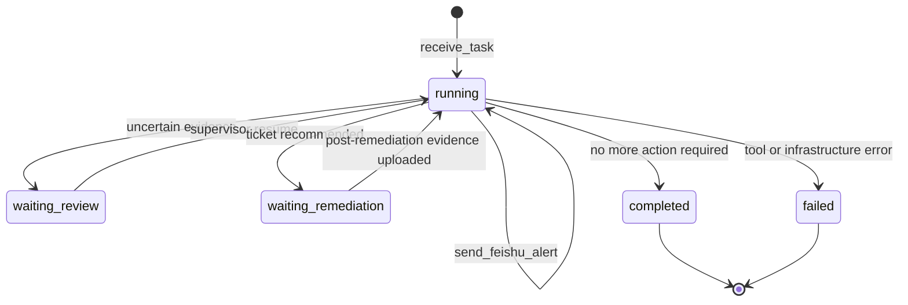

# Agent State Graph

The Agent workflow is defined in
[config/safety_agent_workflow.json](../config/safety_agent_workflow.json). The
JSON file is the machine-readable contract used by documentation and checks.

## State Flow



## Tool Chain

| Order | Tool | Purpose |
| --- | --- | --- |
| 1 | `receive_task` | Create an auditable AgentRun. |
| 2 | `load_video` | Load video bytes and duration. |
| 3 | `sample_video_frames` | Extract key frames for memory and VLM calls. |
| 4 | `inspect_safety_frame` | Call the vision model for risk and bbox grounding. |
| 5 | `validate_bbox` | Check localization quality. |
| 6 | `merge_risk_events` | Merge adjacent frame-level findings into events. |
| 7 | `build_video_memory` | Persist searchable timeline memory. |
| 8 | `decide_safety_action` | Apply safety policy for alert/review/ticket/verification. |
| 9 | `write_audit_report` | Generate the Chinese audit report. |
| 10 | `send_feishu_alert` | Notify supervisors when policy requires it. |
| 11 | `recommend_remediation_ticket` | Prepare ticket action for supervisor confirmation. |
| 12 | `verify_remediation` | Evaluate post-remediation evidence. |

## Pause Points

`waiting_review` is used when the model output is worth attention but not strong
enough to become a formal violation. A supervisor submits a review decision and
then resumes the Agent.

`waiting_remediation` is used when the Agent recommends a remediation ticket or
has already created one. The Agent resumes after post-remediation evidence is
uploaded.

## Verification

Run:

```bash
python scripts/dev.py workflow-check
```

The check validates tool order, transitions, required statuses, MCP tool names,
and references in backend code and README documentation.
