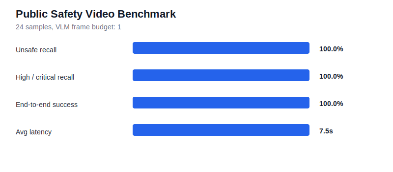

# Public Safety Video Benchmark

This report is generated from [`public-24-one-frame.json`](public-24-one-frame.json).
It evaluates the deployed API workflow on public safety video samples.

## Run Configuration

| Field | Value |
| --- | --- |
| Benchmark type | `public_dataset_evaluation` |
| Generated at | `2026-06-26T06:58:09.763907+00:00` |
| Mode | `api` |
| Data dir | `data/safe_unsafe_behaviours` |
| Samples | `24` |
| Max samples | `24` |
| VLM frame budget | `1` |

## Metrics

| Metric | Key | Value |
| --- | --- | --- |
| Binary unsafe accuracy | `binary_unsafe_accuracy` | 95.8% |
| 8-class accuracy | `class_accuracy` | 58.3% |
| Unsafe precision | `unsafe_precision` | 92.3% |
| Unsafe recall | `unsafe_recall` | 100.0% |
| High / critical recall | `high_critical_recall` | 100.0% |
| End-to-end success | `end_to_end_success_rate` | 100.0% |
| Avg processing seconds | `avg_processing_seconds` | 7.532s |

## Binary Confusion

| TP | FP | TN | FN |
| ---: | ---: | ---: | ---: |
| 12 | 1 | 11 | 0 |

## False Positives

- `closed_panel_cover__6_te10.mp4` expected `closed_panel_cover`, predicted `walkway_violation`

## False Negatives

- None in this run.

## Sample Outputs

| File | Expected | Predicted | Status | Latency |
| --- | --- | --- | --- | ---: |
| `authorized_intervention__5_te12.mp4` | `authorized_intervention` | `safe_walkway` | `completed` | 6.461s |
| `authorized_intervention__5_te13.mp4` | `authorized_intervention` | `safe_walkway` | `completed` | 6.395s |
| `authorized_intervention__5_te14.mp4` | `authorized_intervention` | `safe_walkway` | `completed` | 6.332s |
| `closed_panel_cover__6_te10.mp4` | `closed_panel_cover` | `walkway_violation` | `completed` | 14.559s |
| `closed_panel_cover__6_te12.mp4` | `closed_panel_cover` | `safe_walkway` | `completed` | 6.387s |
| `closed_panel_cover__6_te7.mp4` | `closed_panel_cover` | `safe_walkway` | `completed` | 6.306s |
| `forklift_overload__3_te6.mp4` | `forklift_overload` | `forklift_overload` | `completed` | 6.53s |
| `forklift_overload__3_te7.mp4` | `forklift_overload` | `forklift_overload` | `completed` | 6.527s |
| `forklift_overload__3_te8.mp4` | `forklift_overload` | `forklift_overload` | `completed` | 6.498s |
| `opened_panel_cover__2_te1.mp4` | `opened_panel_cover` | `opened_panel_cover` | `completed` | 6.434s |
| `opened_panel_cover__2_te12.mp4` | `opened_panel_cover` | `opened_panel_cover` | `completed` | 6.303s |
| `opened_panel_cover__2_te13.mp4` | `opened_panel_cover` | `walkway_violation` | `completed` | 14.526s |
| `safe_carrying__7_te3.mp4` | `safe_carrying` | `safe_walkway` | `completed` | 6.288s |
| `safe_carrying__7_te4.mp4` | `safe_carrying` | `safe_walkway` | `completed` | 4.288s |
| `safe_carrying__7_te5.mp4` | `safe_carrying` | `safe_walkway` | `completed` | 6.379s |
| `safe_walkway__4_te5.mp4` | `safe_walkway` | `safe_walkway` | `completed` | 8.387s |
| `safe_walkway__4_te6.mp4` | `safe_walkway` | `safe_walkway` | `completed` | 6.323s |
| `safe_walkway__4_te7.mp4` | `safe_walkway` | `safe_walkway` | `completed` | 6.552s |
| `unauthorized_intervention__1_te10.mp4` | `unauthorized_intervention` | `unauthorized_intervention` | `completed` | 8.621s |
| `unauthorized_intervention__1_te11.mp4` | `unauthorized_intervention` | `unauthorized_intervention` | `completed` | 6.456s |
| `unauthorized_intervention__1_te7.mp4` | `unauthorized_intervention` | `unauthorized_intervention` | `completed` | 8.639s |
| `walkway_violation__0_te21.mp4` | `walkway_violation` | `walkway_violation` | `completed` | 6.462s |
| `walkway_violation__0_te22.mp4` | `walkway_violation` | `walkway_violation` | `completed` | 8.55s |
| `walkway_violation__0_te23.mp4` | `walkway_violation` | `walkway_violation` | `completed` | 10.576s |

## Notes

- This benchmark uses a one-frame VLM budget by default to control cost.
- One-frame evaluation is intentionally low cost; increase `--vision-max-frames` for a higher-recall run.
- Model outputs are safety-assistant signals and require human review before operational decisions.
